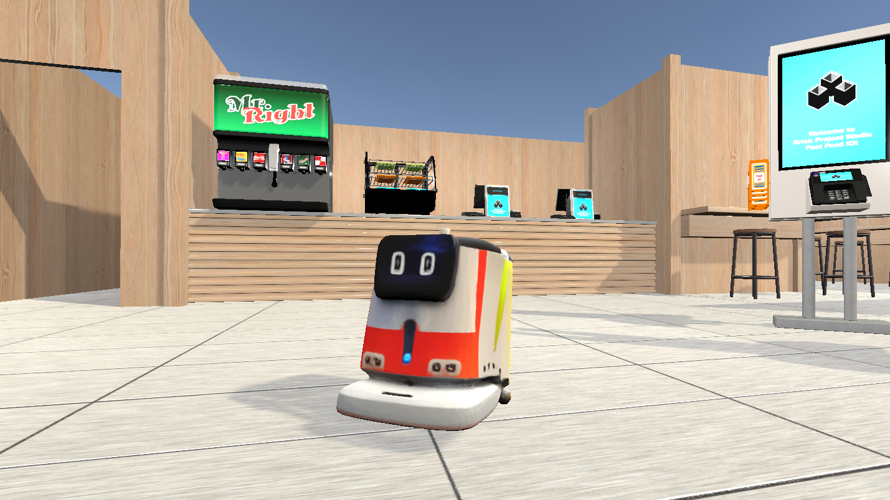

# Intro to ROS2: Mobile Robot Simulation

This repository provides a simple simulation environment—including a mobile robot—to help you learn basic path-planning algorithms as part of the Skoltech Robotics Course.  
Using this setup, you will learn how to connect ROS2 nodes to a Unity simulation.

The project contains two main folders:

- **MobileRobotSim** — a prebuilt Unity simulation  
- **RoboticsLesson_ws** — a ROS2 workspace containing the final exam task

---
## 0. Prerequesites (mac only)
0. Install the mac build zip file from [here](https://github.com/Taintedy/MobileRobotEnv/releases/tag/arm64_mac_build) and unpack it in the repository root file.
1. Install *TurboVNC-3.2.1-arm64.dmg*
2. build docker image with ros and graphics
```bash
docker build -t ros-vnc .
```
3. run the container
```bash
docker run -it --privileged -p 5900:5900 -p 10000:10000 -v /path/to/MobileRobotEnv:/home/MobileRobotEnv ros-vnc bash
```
4. (optional) attach to the container in another terminal
```bash
docker exec -it CONTAINER_ID bash
```
5. test opengl support
```bash
# in container
rviz2
```
then open TurboVNC Viewer app and connect to the **localhost:5900** server. Rviz2 window should appear. The rest of the instructions (except 1.) should be executed in docker container.


## 1. Running the Unity Simulation

To start the simulation, unzip  the `MobileRobotSim.zip` (or `MobileRobotSim_mac.zip`) file and open a terminal (`Ctrl + Alt + T`), navigate to the application folder, and run:

**linux:**
```bash
cd <path_to_workspace>/MobileRobotSim
chmod +x MobileRobotSim.x86_64
./MobileRobotSim.x86_64
```
**mac (locally, without docker):**
```bash
cd <path_to_workspace>/MobileRobotSim_mac
open MobileRobotSim.app
```

A window will appear showing the janitor mobile robot inside a fast-food restaurant:


<p align="center">
  
</p>


## 2. Setting Up the ROS2 Workspace
Open a second terminal and navigate to the `RoboticsLesson_ws` folder. Install the `ROS_TCP_Endpoint` package:

```bash
echo "export ROS_LOCALHOST_ONLY=1" >> ~/.bashrc
cd <path_to_workspace>/RoboticsLesson_ws/src
git clone https://github.com/Unity-Technologies/ROS-TCP-Endpoint.git -b main-ros2 
```

`ROS_TCP_Endpoint` enables communication between Unity and your ROS2 nodes.

Now build and source the workspace:

```bash
cd ../
colcon build 
source install/setup.bash
```

## 3. Running ROS_TCP_Endpoint

In a new terminal, start the endpoint server:

```bash
ros2 run ros_tcp_endpoint default_server_endpoint
```

Once running, the Unity simulation will connect to ROS2. The red arrows in Unity should turn blue and yellow:

<p align="center">
  
</p>

## 4. The Task

Open the workspace in your preferred editor (e.g., VS Code) and locate the main navigation script:

```bash
RoboticsLesson_ws/src/navigation_pkg/navigation_node.py
```

This script defines the structure of the path-planning node. It subscribes to:

- `/obstacle_pointcloud` — receives a [PointCloud2](https://docs.ros.org/en/noetic/api/sensor_msgs/html/msg/PointCloud2.html) representing obstacles

- `/robot_goal` — receives a [PoseStamped](https://docs.ros2.org/foxy/api/geometry_msgs/msg/PoseStamped.html) representing the goal position

Your node must publish a [Path](https://docs.ros.org/en/noetic/api/nav_msgs/html/msg/Path.html).  
Fill in all the `TODO` sections in the script.

After completing the TODOs, rebuild and source the workspace:

```bash
cd <path_to_workspace>/RoboticsLesson_ws/
colcon build 
source install/setup.bash
```

Then run your path-planner node:

```bash
ros2 run navigation_pkg navigation_node
```

To verify the result, run the test script once your planner is ready:

```bash
ros2 run navigation_pkg test
```


## 4. Example Output

Below is an example of a completed solution:

#### Simulation view
<p align="center">
  
</p>

#### Rviz view
<p align="center">
  
</p>


## 5. Useful Commands

Below are some essential ROS2 tools and command-line utilities that will help you inspect and debug your system while working with the Unity simulation.

### GUI Tools

#### **rqt**
Launches the RQT framework, which provides a collection of GUI plugins such as topic monitors, publishers, and node graphs.

```bash
rqt
```

#### **rviz2**
Starts RViz2, the main visualization tool in ROS2.
Use this to view your robot, paths, point clouds, and other data.

```bash
rviz2
```

This lessons RViz2 file is in the `<path_to_workspace>/RoboticsLesson_ws/rviz` folder.

### Topic Commands

ROS2 provides a set of helpful `ros2 topic` commands for inspecting and interacting with topics:

```
ros2 topic list       # List all active topics
ros2 topic info <topic_name>   # Show detailed info about a topic
ros2 topic pub <topic_name> <msg_type> <args>   # Manually publish messages (you can do this with rqt)
```
For more details, see:
[Understanding topics](https://docs.ros.org/en/foxy/Tutorials/Beginner-CLI-Tools/Understanding-ROS2-Topics/Understanding-ROS2-Topics.html)
